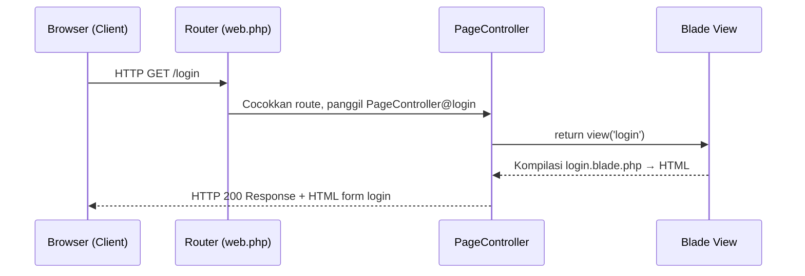
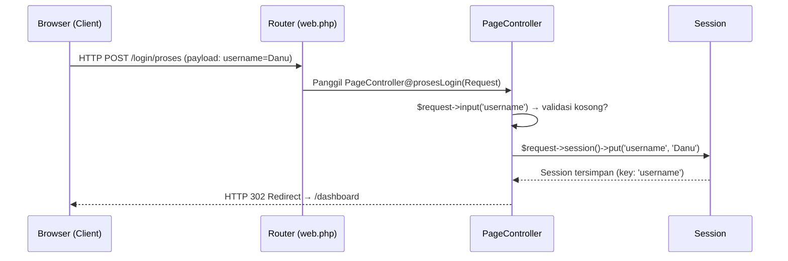
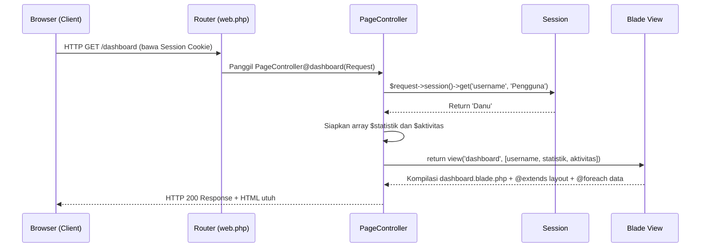
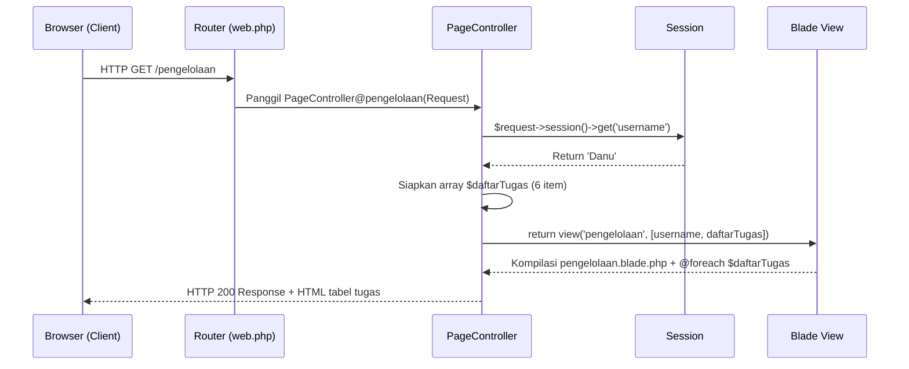
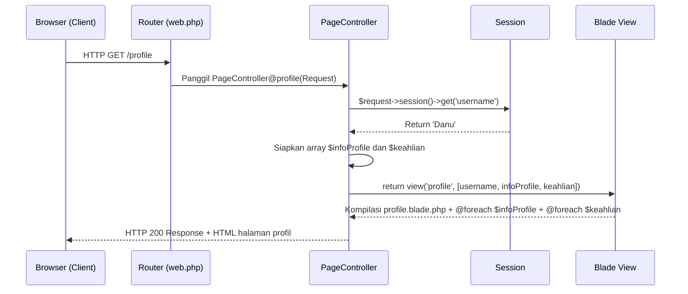
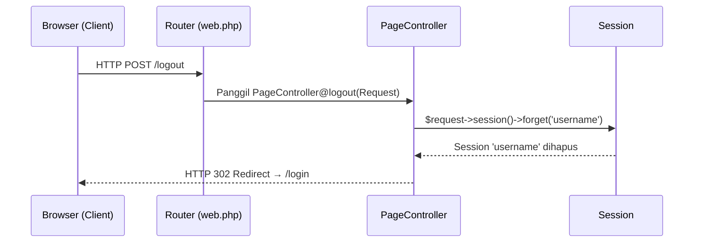

# 📋 Project UTS
## Aplikasi Manajemen Tugas Berbasis Laravel MVC

> **Mata Kuliah:** Pemrograman Web  
> **Teknologi:** Laravel · PHP · Blade Engine · Font Awesome v5 · Google Fonts (Inter)  
> **Tema Desain:** Minimalism — Color Palette Matcha Green

---

## 📁 BAGIAN Gambaran Umum Project

###
Aplikasi web manajemen tugas sederhana yang dibangun menggunakan framework Laravel dengan pola arsitektur **MVC (Model–View–Controller)**. Aplikasi ini memungkinkan pengguna untuk:

1. **Login** menggunakan username (disimpan ke Session)
2. Melihat **Dashboard** berisi statistik dan aktivitas terbaru
3. Melihat **Pengelolaan Tugas** berupa tabel daftar tugas
4. Melihat halaman **Profil** berisi informasi dan keahlian pengguna
5. **Logout** yang menghapus session

> Tidak ada database / CRUD — semua data disimulasikan menggunakan **array PHP** di dalam Controller, sesuai ketentuan UTS.

---

## 🗂️ BAGIAN Struktur File Project

```
UTSB/                                   ← Root project Laravel
│
├── routes/
│   └── web.php                         ← [1] Semua definisi URL & routing
│
├── app/Http/Controllers/
│   └── PageController.php              ← [2] Satu-satunya Controller (semua logika)
│
├── resources/views/
│   ├── layouts/
│   │   └── app.blade.php               ← [3] Master Layout (kerangka HTML utama)
│   │
│   ├── login.blade.php                 ← [4] View: Halaman Login
│   ├── dashboard.blade.php             ← [5] View: Halaman Dashboard
│   ├── pengelolaan.blade.php           ← [6] View: Halaman Pengelolaan
│   ├── profile.blade.php               ← [7] View: Halaman Profil
│   │
│   └── components/
│       ├── navbar.blade.php            ← [8] Blade Component: Navigasi
│       └── footer.blade.php            ← [9] Blade Component: Footer
│
└── public/
    └── images/
        └── LogoD.png                   ← Aset logo brand Dexornit
```

### Skenario 1 — User Membuka Halaman Login



### Skenario 2 — User Submit Form Login



### Skenario 3 — User Membuka Dashboard



### Skenario 4 — User Membuka Pengelolaan



### Skenario 5 — User Membuka Profil



### Skenario 6 — User Logout



---

### Alur Penggunaan

```
[Buka Browser] → /login
    ↓ Masukkan username (bebas) → klik "Masuk"
[Dashboard] → lihat statistik & aktivitas
    ↓ Klik "Pengelolaan" di navbar
[Pengelolaan] → lihat tabel daftar tugas
    ↓ Klik "Profil" di navbar
[Profil] → lihat info & skill bar
    ↓ Klik "Keluar"
[Kembali ke Login]
```

### Tampilan Login


### Tampilan Dashboard


### Tampilan Pengelolaan


### Tampilan Profile

